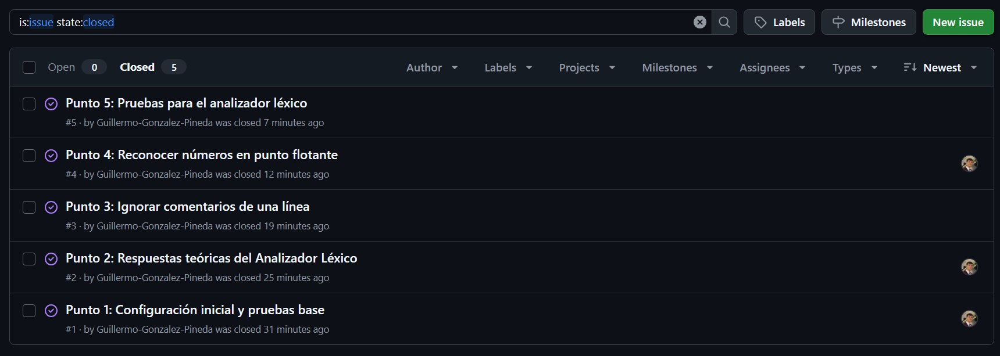
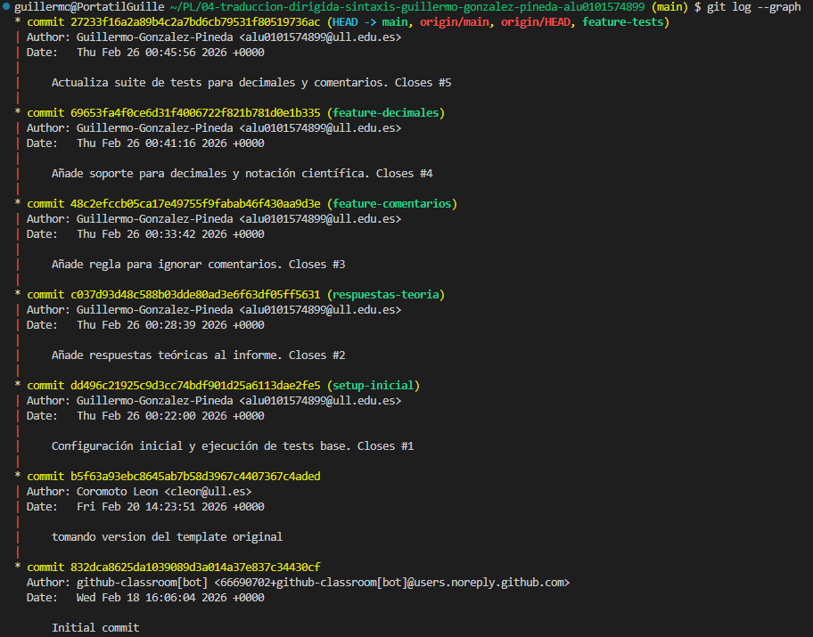

# Práctica 4 - Analizador Léxico en Jison

## Objetivo
Extender el analizador léxico de una calculadora en **Jison** para que sea capaz de ignorar comentarios (`//`) y reconocer números en punto flotante y notación científica.


## 1. Modificaciones en el Analizador Léxico
Se ha actualizado el bloque `%lex` en el archivo `src/grammar.jison`. Se implementó el emparejamiento más largo (*Maximal Munch*) para las siguientes expresiones regulares:

```jison
\/\/.* { /* skip single line comments */ }
[0-9]+(\.[0-9]+)?([eE][-+]?[0-9]+)?   { return 'NUMBER'; }

```

---

## 2. Pruebas Unitarias (Jest)

Se actualizó la suite de pruebas `parser.test.js` eliminando las restricciones de números enteros y añadiendo validaciones específicas (17 pruebas superadas en total) para las nuevas expresiones regulares y el salto de comentarios.
```javascript
  describe('Modificaciones del lexer', () => {
      test('should ignore whitespace and comments', () => {
        expect(parse("// Esto es un comentario\n3 + 5")).toBe(8);
        expect(parse("   2 * 4   ")).toBe(8);
        expect(parse("1 + 2 // Suma")).toBe(3);
      });

      test('debe reconocer números con decimales y notación científica', () => {
        expect(parse("3.14")).toBe(3.14);
        expect(parse("2e10")).toBe(20000000000);
        expect(parse("1.5e-3")).toBe(0.0015);
      });

      test('Debe operar correctamente con números decimales y notación científica', () => {
        expect(parse("3.14 + 2e10")).toBe(20000000003.14);
        expect(parse("1.5e-3 * 2")).toBe(0.003);
        expect(parse("5 / 2e-3")).toBe(2500);
      });
    });
  ```

---

## 3. Metodología y Control de Versiones

### Tablero de Issues


### Grafo de Confirmaciones (Commits & Merges)


---

## 📝 4. Respuestas a las preguntas teóricas del guion

**3.1. Describa la diferencia entre `/* skip whitespace */` y devolver un token:**
Cuando el analizador léxico ejecuta `/* skip */` (o un bloque vacío), simplemente avanza en la lectura de los caracteres y los ignora, sin enviarle nada al analizador sintáctico. Por el contrario, cuando ejecuta `return 'TOKEN'`, empaqueta la secuencia de caracteres que acaba de leer (el lexema) en un Token estructural y se lo envía al analizador sintáctico para que lo evalúe dentro de sus reglas gramaticales.

**3.2. Escriba la secuencia exacta de tokens producidos para la entrada `123**45+@`:**
El analizador léxico procesará la entrada de izquierda a derecha aplicando la técnica del emparejamiento más largo (*Maximal Munch*), generando la siguiente secuencia:

1. `NUMBER` (por el lexema `123`)
2. `OP` (por el lexema `**`)
3. `NUMBER` (por el lexema `45`)
4. `OP` (por el lexema `+`)
5. `INVALID` (por el carácter no reconocido `@`)

**3.3. Indique por qué `**` debe aparecer antes que `[-+*/]`:**
Jison evalúa las expresiones regulares secuencialmente de arriba a abajo. Si la regla para la multiplicación/suma `[-+*/]` se colocara primero, al encontrar la cadena `**`, el escáner se detendría en el primer asterisco y devolvería un token de multiplicación (`OP` genérico), ignorando el operador de potencia. Al poner `**` primero, garantizamos que se busque siempre la coincidencia más larga posible.

**3.4. Explique cuándo se devuelve `EOF`:**
El símbolo especial `<<EOF>>` (End Of File) se devuelve únicamente cuando el escáner ha terminado de leer la totalidad del flujo de caracteres de entrada y no queda nada más por procesar. Actúa como señal de finalización para que el analizador sintáctico sepa que puede resolver y devolver la operación completa.

**3.5. Explique por qué existe la regla `.` que devuelve `INVALID`:**
El punto `.` es una expresión regular que encaja con "cualquier carácter". Al estar situada en la última línea del lexer, funciona como una regla de seguridad (*catch-all*). Si el usuario introduce un carácter ilegal (letras u otros símbolos) que no coincide con las reglas matemáticas superiores, el escáner caerá en esta regla, permitiendo generar un token de error y gestionar el fallo de manera controlada en lugar de colgar el proceso.