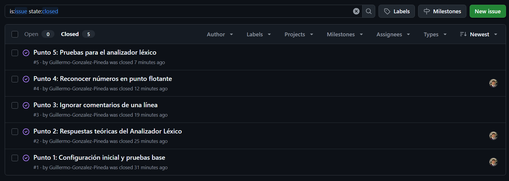
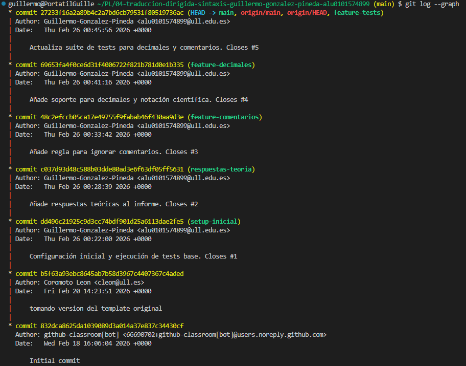

# Práctica 4 - Analizador Léxico en Jison

## Objetivo
Extender el analizador léxico de una calculadora en **Jison** para que sea capaz de ignorar comentarios (`//`) y reconocer números en punto flotante y notación científica.


## 1. Modificaciones en el Analizador Léxico
Se ha actualizado el bloque `%lex` en el archivo `src/grammar.jison`. Se implementó el emparejamiento más largo (*Maximal Munch*) para las siguientes expresiones regulares:

```jison
\/\/.* { /* skip single line comments */ }
[0-9]+(\.[0-9]+)?([eE][-+]?[0-9]+)?   { return 'NUMBER'; }

```

---

## 2. Pruebas Unitarias (Jest)

Se actualizó la suite de pruebas `parser.test.js` eliminando las restricciones de números enteros y añadiendo validaciones específicas (17 pruebas superadas en total) para las nuevas expresiones regulares y el salto de comentarios.
```javascript
  describe('Modificaciones del lexer', () => {
      test('should ignore whitespace and comments', () => {
        expect(parse("// Esto es un comentario\n3 + 5")).toBe(8);
        expect(parse("   2 * 4   ")).toBe(8);
        expect(parse("1 + 2 // Suma")).toBe(3);
      });

      test('debe reconocer números con decimales y notación científica', () => {
        expect(parse("3.14")).toBe(3.14);
        expect(parse("2e10")).toBe(20000000000);
        expect(parse("1.5e-3")).toBe(0.0015);
      });

      test('Debe operar correctamente con números decimales y notación científica', () => {
        expect(parse("3.14 + 2e10")).toBe(20000000003.14);
        expect(parse("1.5e-3 * 2")).toBe(0.003);
        expect(parse("5 / 2e-3")).toBe(2500);
      });
    });
  ```

---

## 3. Metodología y Control de Versiones

### Tablero de Issues


### Grafo de Confirmaciones (Commits & Merges)


---

## 📝 4. Respuestas a las preguntas teóricas del guion

**3.1. Describa la diferencia entre `/* skip whitespace */` y devolver un token:**
Cuando el analizador léxico ejecuta `/* skip */` (o un bloque vacío), simplemente avanza en la lectura de los caracteres y los ignora, sin enviarle nada al analizador sintáctico. Por el contrario, cuando ejecuta `return 'TOKEN'`, empaqueta la secuencia de caracteres que acaba de leer (el lexema) en un Token estructural y se lo envía al analizador sintáctico para que lo evalúe dentro de sus reglas gramaticales.

**3.2. Escriba la secuencia exacta de tokens producidos para la entrada `123**45+@`:**
El analizador léxico procesará la entrada de izquierda a derecha aplicando la técnica del emparejamiento más largo (*Maximal Munch*), generando la siguiente secuencia:

1. `NUMBER` (por el lexema `123`)
2. `OP` (por el lexema `**`)
3. `NUMBER` (por el lexema `45`)
4. `OP` (por el lexema `+`)
5. `INVALID` (por el carácter no reconocido `@`)

**3.3. Indique por qué `**` debe aparecer antes que `[-+*/]`:**
Jison evalúa las expresiones regulares secuencialmente de arriba a abajo. Si la regla para la multiplicación/suma `[-+*/]` se colocara primero, al encontrar la cadena `**`, el escáner se detendría en el primer asterisco y devolvería un token de multiplicación (`OP` genérico), ignorando el operador de potencia. Al poner `**` primero, garantizamos que se busque siempre la coincidencia más larga posible.

**3.4. Explique cuándo se devuelve `EOF`:**
El símbolo especial `<<EOF>>` (End Of File) se devuelve únicamente cuando el escáner ha terminado de leer la totalidad del flujo de caracteres de entrada y no queda nada más por procesar. Actúa como señal de finalización para que el analizador sintáctico sepa que puede resolver y devolver la operación completa.

**3.5. Explique por qué existe la regla `.` que devuelve `INVALID`:**
El punto `.` es una expresión regular que encaja con "cualquier carácter". Al estar situada en la última línea del lexer, funciona como una regla de seguridad (*catch-all*). Si el usuario introduce un carácter ilegal (letras u otros símbolos) que no coincide con las reglas matemáticas superiores, el escáner caerá en esta regla, permitiendo generar un token de error y gestionar el fallo de manera controlada en lugar de colgar el proceso.

---


# Práctica 5 - Precedencia y Asociatividad

## 1. Análisis de la Gramática Base

### 1.1. Derivación para cada una de las frases

**Frase 1: `4.0 - 2.0 * 3.0`**
Aplicando derivación por la izquierda:
$E \Rightarrow E \text{ op } T$
$\Rightarrow E \text{ op } T \text{ op } T$
$\Rightarrow T \text{ op } T \text{ op } T$
$\Rightarrow \text{number} \text{ op } T \text{ op } T$
$\Rightarrow 4.0 \text{ op } T \text{ op } T$
$\Rightarrow 4.0 \text{ - } T \text{ op } T$
$\Rightarrow 4.0 \text{ - } \text{number} \text{ op } T$
$\Rightarrow 4.0 \text{ - } 2.0 \text{ op } T$
$\Rightarrow 4.0 \text{ - } 2.0 \text{ * } T$
$\Rightarrow 4.0 \text{ - } 2.0 \text{ * } \text{number}$
$\Rightarrow 4.0 \text{ - } 2.0 \text{ * } 3.0$

**Frase 2: `2 ** 3 ** 2`**
Aplicando derivación por la izquierda:
$E \Rightarrow E \text{ op } T$
$\Rightarrow E \text{ op } T \text{ op } T$
$\Rightarrow T \text{ op } T \text{ op } T$
$\Rightarrow \text{number} \text{ op } T \text{ op } T$
$\Rightarrow 2 \text{ op } T \text{ op } T$
$\Rightarrow 2 \text{ ** } T \text{ op } T$
$\Rightarrow 2 \text{ ** } \text{number} \text{ op } T$
$\Rightarrow 2 \text{ ** } 3 \text{ op } T$
$\Rightarrow 2 \text{ ** } 3 \text{ ** } T$
$\Rightarrow 2 \text{ ** } 3 \text{ ** } \text{number}$
$\Rightarrow 2 \text{ ** } 3 \text{ ** } 2$

**Frase 3: `7 - 4 / 2`**
Aplicando derivación por la izquierda:
$E \Rightarrow E \text{ op } T$
$\Rightarrow E \text{ op } T \text{ op } T$
$\Rightarrow T \text{ op } T \text{ op } T$
$\Rightarrow \text{number} \text{ op } T \text{ op } T$
$\Rightarrow 7 \text{ op } T \text{ op } T$
$\Rightarrow 7 \text{ - } T \text{ op } T$
$\Rightarrow 7 \text{ - } \text{number} \text{ op } T$
$\Rightarrow 7 \text{ - } 4 \text{ op } T$
$\Rightarrow 7 \text{ - } 4 \text{ / } T$
$\Rightarrow 7 \text{ - } 4 \text{ / } \text{number}$
$\Rightarrow 7 \text{ - } 4 \text{ / } 2$


### 1.2. Árboles de Análisis Sintáctico (Parse Trees)

Al utilizar la gramática base (`E -> E OP T | T`), la recursividad por la izquierda fuerza a que el árbol crezca siempre hacia la izquierda, lo que demuestra la ausencia de precedencia de operadores y la estricta asociatividad por la izquierda para todas las operaciones.

**Frase 1: `4.0 - 2.0 * 3.0`**


```text
         E
       / | \
      /  |  \
     E   OP  T
   / | \ (*) |
  E  OP T   3.0
  | (-) |
  T    2.0
  |
 4.0
```

**Frase 2: `2 ** 3 ** 2`**
```text
         E
       / | \
      /  |  \
     E   OP  T
   / | \ (**) |
  E  OP T     2
  | (**) |
  T      3
  |
  2
```

**Frase 3: `7 - 4 / 2`**
```text
         E
       / | \
      /  |  \
     E   OP  T
   / | \ (-) |
  E  OP T    2
  | (/) |
  T     4
  |
  7
```


### 1.3. Orden de evaluación de las acciones semánticas

Como Jison genera un analizador sintáctico ascendente (LALR), las acciones semánticas se ejecutan en el momento en que se realizan las reducciones (de las hojas hacia la raíz). Al utilizar una única regla recursiva por la izquierda (`E -> E OP T`), el orden de evaluación fuerza a agrupar siempre los operandos de izquierda a derecha.

**Frase 1: `4.0 - 2.0 * 3.0`**
1. Se lee `4.0` y se reduce a `E` (Valor = 4.0).
2. Se lee `-` y `2.0`, reduciendo `2.0` a `T`.
3. **Primera acción semántica:** Se reduce `E - T`. Se calcula $4.0 - 2.0 = 2.0$. (El nuevo valor de `E` es 2.0).
4. Se lee `*` y `3.0`, reduciendo `3.0` a `T`.
5. **Segunda acción semántica:** Se reduce `E * T`. Se calcula $2.0 * 3.0 = 6.0$.
* **Fallo matemático:** La multiplicación debería tener precedencia sobre la resta. El resultado correcto en matemáticas sería $-2.0$, no $6.0$.

**Frase 2: `2 ** 3 ** 2`**
1. Se lee `2` y se reduce a `E` (Valor = 2).
2. Se lee `**` y `3`, reduciendo `3` a `T`.
3. **Primera acción semántica:** Se reduce `E ** T`. Se calcula $2^3 = 8$. (El nuevo valor de `E` es 8).
4. Se lee `**` y `2`, reduciendo `2` a `T`.
5. **Segunda acción semántica:** Se reduce `E ** T`. Se calcula $8^2 = 64$.
* **Fallo matemático:** El operador de potencia (`**`) en matemáticas y programación es asociativo por la derecha ($2^{(3^2)}$), por lo que el resultado correcto debería ser $2^9 = 512$, no $64$.

**Frase 3: `7 - 4 / 2`**
1. Se lee `7` y se reduce a `E` (Valor = 7).
2. Se lee `-` y `4`, reduciendo `4` a `T`.
3. **Primera acción semántica:** Se reduce `E - T`. Se calcula $7 - 4 = 3$. (El nuevo valor de `E` es 3).
4. Se lee `/` y `2`, reduciendo `2` a `T`.
5. **Segunda acción semántica:** Se reduce `E / T`. Se calcula $3 / 2 = 1.5$.
* **Fallo matemático:** La división debería tener precedencia sobre la resta. El resultado correcto en matemáticas sería $7 - 2 = 5$, no $1.5$.


### 1.4. Análisis de Fallos: Precedencia y Asociatividad de Operadores

Al ejecutar la nueva suite de pruebas `prec.test.js`, hemos detectado que nuestro analizador sintáctico (parser) actual falla en múltiples escenarios. El problema raíz es que el parser evalúa las expresiones estrictamente **de izquierda a derecha**, ignorando por completo las reglas matemáticas fundamentales de precedencia y asociatividad.

A continuación, se desglosan los fallos por categoría:

#### 1. Multiplicación/División vs. Suma/Resta
El parser no respeta que la multiplicación (`*`) y la división (`/`) deben resolverse antes que la suma (`+`) y la resta (`-`).

* **Expresión:** `2 + 3 * 4`
    * **Esperado:** `14` (Calculando primero `3 * 4 = 12`, luego `2 + 12`).
    * **Recibido:** `20` (El parser hizo `(2 + 3) * 4`).
* **Expresión:** `1 + 2 * 3 - 4`
    * **Esperado:** `3` (Calculando `1 + 6 - 4`).
    * **Recibido:** `5` (El parser hizo `(((1 + 2) * 3) - 4)`).
* **Expresión:** `1 + 2 * 3`
    * **Esperado:** `7` (Calculando `1 + 6`).
    * **Recibido:** `9` (El parser hizo `(1 + 2) * 3`).

#### 2. Precedencia de la Exponenciación
La exponenciación (`**`) tiene la precedencia más alta en matemáticas básicas (antes que la multiplicación/división y suma/resta). Nuestro parser actual la evalúa al mismo nivel que el resto.

* **Expresión:** `2 + 3 ** 2`
    * **Esperado:** `11` (Calculando primero `3 ** 2 = 9`, luego `2 + 9`).
    * **Recibido:** `25` (El parser hizo `(2 + 3) ** 2 = 5 ** 2`).
* **Expresión:** `3 + 2 ** 4`
    * **Esperado:** `19` (Calculando primero `2 ** 4 = 16`, luego `3 + 16`).
    * **Recibido:** `625` (El parser hizo `(3 + 2) ** 4 = 5 ** 4`).

#### 3. Asociatividad a la Derecha
La mayoría de operadores (como `+`, `-`, `*`, `/`) son asociativos a la izquierda (ej. `a - b - c` es `(a - b) - c`). Sin embargo, **la exponenciación es asociativa a la derecha** (`a ** b ** c` debe ser `a ** (b ** c)`). Nuestro parser no contempla esta regla.

* **Expresión:** `2 ** 3 ** 2`
    * **Esperado:** `512` (Calculando primero la parte derecha `3 ** 2 = 9`, resultando en `2 ** 9`).
    * **Recibido:** `64` (El parser evaluó de izquierda a derecha: `(2 ** 3) ** 2 = 8 ** 2`).